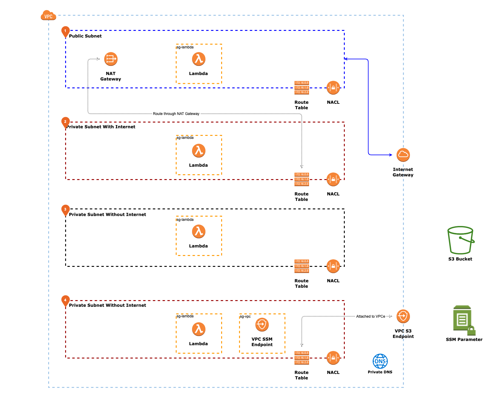

# VPC Notes

My notes on creating a VPC in AWS.

I use terraform to create the VPC (underlying EC2s, NAT Gateway etc etc)

Then I use serverless framework to deploy lambda functions into the VPC.

Pre-requisites:
* Generate a RSA keypair, and use it to populate `public key` in the `ec2.tf` file. This will allow access to the EC2 functions in the VPC.
* Alternatively, if you don't need EC2 instances, delete the `ec2.tf` file.

# Installation

Installation steps:

    $ terraform apply
    $ cd serverless
    $ sls deploy
    
To uninstall

    $ cd serverless
    $ sls remove
    $ terraform destroy

VPC will look something like this:

# VPC

When creating a VPC, AWS automatically provisions:

* A default Network ACL
* A default Security group
* A default Route Table

AWS also automatically provision a DNS server, and connect all EC2 instances to that DNS via DHCP option sets.

## Subnet

Create a subnet within the VPC (or multiple subnets) to segregate the VPC.

Each Subnet can have one (and only one) Network ACL. The Network ACL is attached to the Subnet, while the Security Group is attached to the instance in the Subnet. The Route Table is attached to the VPC as a whole.

## Internet Gateway

You need to attach an IGW to a VPC in order for it to connect to the internet. An IGW is at the VPC level, but needs you'd need to route traffic from each subnet to the IGW to make it internet accessible.

There are egress only internet gateways -- that allow for egress only data to the internet. (ipv6 only)

## Route Table

Add a route table to the create routes (there's a default for the CIDR of the VPC to 'local')

Then associate that route table to the Subnet you need.

## Security Groups

Security Groups are tied to an ENI of the instance (or other resources like lambda/RDS). Regardless of what the Route Table allows, the Security group must be enabled to support the traffic for it to happen for traffic to reach/exit the EC2.

Security groups can reference CIDR and IP ranges, but also other security groups (including themselves). They can reference security groups within the VPC or external from the VPC -- but not from security groups in other regions. 

Security groups are **stateful**, hence if you enable ingress ICMP for example, it will allow the ICMP response to egress out. Similarly if you allow port 80 incoming -- it will allow the http response to go back out without an explicit egress(outbound) rule.

You cannot filter traffic to or from a DNS server using network ACLs or security groups (for Amazon DNS). For traffic to external DNS Servers like Cloudflare, Google etc, these can be restricted using security groups/NACLs like any other traffic.

All traffic in/out of an EC2 is restricted by the security group, regardless of the source or destination of the traffic.

Remember security groups cannot block traffic -- only allow them, it's a bit tricky, but generally blocking traffic is recommended to be executed at the Network ACL level.

## Network ACL

Network ACLs are stateless. Summary from the [AWS FAQ](https://docs.aws.amazon.com/vpc/latest/userguide/vpc-network-acls.html):

	Your VPC automatically comes with a modifiable default network ACL. By default, it allows all inbound and outbound IPv4 traffic and, if applicable, IPv6 traffic.

    You can create a custom network ACL and associate it with a subnet. By default, each custom network ACL denies all inbound and outbound traffic until you add rules.

    Each subnet in your VPC must be associated with a network ACL. If you don't explicitly associate a subnet with a network ACL, the subnet is automatically associated with the default network ACL.

    You can associate a network ACL with multiple subnets. However, a subnet can be associated with only one network ACL at a time. When you associate a network ACL with a subnet, the previous association is removed.

    A network ACL contains a numbered list of rules. We evaluate the rules in order, starting with the lowest numbered rule, to determine whether traffic is allowed in or out of any subnet associated with the network ACL. The highest number that you can use for a rule is 32766. We recommend that you start by creating rules in increments (for example, increments of 10 or 100) so that you can insert new rules where you need to later on.

    A network ACL has separate inbound and outbound rules, and each rule can either allow or deny traffic.

    Network ACLs are stateless, which means that responses to allowed inbound traffic are subject to the rules for outbound traffic (and vice versa).

You cannot filter traffic to or from a DNS server using network ACLs or security groups (for Amazon DNS)

All traffic in/out of the Subnet is managed by the Network ACL regardless of source/destination of the target, including traffic internal to the VPC.

## EC2 Keypairs

It's important to note that EC2 keypairs have fingerprints shown on the AWS Console that aren't that intuitive to verify. The way to calculate the fingerprint of your public key, to verify against aws is:

	$ ssh-keygen -e -f id_rsa.pub -m pkcs8 | openssl pkey -pubin -outform der | openssl md5 -c

## Load Balancers

There are two types of load balancers, Network Load Balancer and Application Load Balancers.

Application load balancer operates on Layer 7 (application), but currently only support HTTP and HTTPs (HTTP/2 inclusive). Application load balancers can inspect the HTTP payload and headers, and can route accordingly, it also supports sticky sessions.

Network load balancers operates on Layer 4(network). It routes entirely based on TCP packet info only. It does not support sticky sessions -- and http termination occurs on the target (typically EC2 or Fargate instance)

## VPC Flow Logs

Flows logs can be created at a VPC, Subnet of Network Interface level.

You can filter by Accepted/Rejected/All traffic. Flow logs can be stored in CloudWatchLogs or S3.

You **cannot** change the configuration of a flow log once it's created. Flows to the Amazon DNS is not captured in the flow logg.

## Lambdas in VPCs

Lambdas can be deployed in both Public and Private subnets -- but will only have network connectivity in Private Subnets. This means, any lambda deployed in a Private Subnet can't access both the VPC or the internet, it will however be able to perform calculations a return values -- it just will have a broken network connection for anything else (including making AWS API calls).

Lambdas deployed in private subnets exhibit the same behavior as their EC2 cousions.

## VPC Endpoints

VPC endpoints can be deployed into a VPC to allow connectivity to AWS services (e.g. S3, SSM, DynamoDB, etc)

There are 2 types of VPC Endpoints:

* Gateway endpoints -- deployed via route table associations
* Interface endpoints -- deployed into subnets, and have security groups associated with them

Interface Endpoint is an ENI (think network card) within your VPC. It uses DNS record to direct your traffic to the private IP address of the interface. Gateway Endpoint uses route prefix in your route table to direct traffic meant for S3 or DynamoDB to the Gateway Endpoint (think 0.0.0.0/0 -> igw). 

In terraform, you need to `private_dns_enabled = true` for the VPC endpoint.
